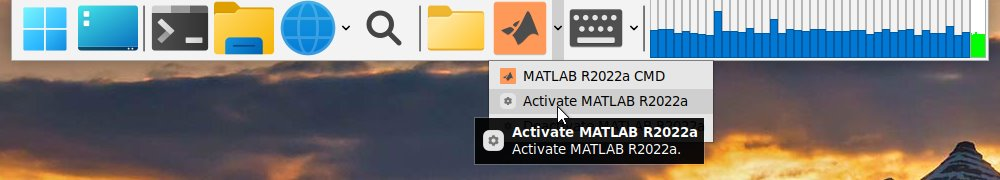

# Dockerfile Collection for DGX-230

To get back to the main page, click [here](./index).

To view the manual for using images, click [here](./manual).

To view the detailed graphic guides, click [here](./manual-session).

To view extra manuals about xUbuntu, click [here](./manual-xubuntu).

## Docker image info list
{:.no_toc}

Here we would show the list of currently built images. Please check each item to find the information of any specific image.

### Table of contents

* TOC
{:toc}

### xUbuntu

The following images are built based on [xubuntu branch][git-xubuntu].

-----

#### nvcr.io/uoh053018/xubuntu-tf:1.8-2.10.1

**X-Ubuntu Tensorflow 2**

The xubuntu TensorFlow `2.x` image. Currently, the TensorFlow version is `2.10.1`.

This image is built based on the following command:

```bash
docker build -t nvcr.io/uoh053018/xubuntu-tf:1.8-2.10.1 --build-arg BASE_IMAGE=nvcr.io/nvidia/tensorflow:22.12-tf2-py3 --build-arg BASE_LAUNCH=/opt/nvidia/nvidia_entrypoint.sh --build-arg WITH_EXTRA_APPS=cpgo --build-arg INIT_UID=$(id -u) --build-arg INIT_GID=$(id -g) https://github.com/Y326s/DGX-DockerImages.git#xubuntu-1.8
```

This image has been also uploaded to our NGC account, check [here][nv-tf] for viewing details. With our NVIDIA account, you could pull the image directly by:

```bash
docker pull nvcr.io/uoh053018/xubuntu-tf:1.8-2.10.1
```

This image contains:

* `Tensorflow 2.10.1`
* `Python 3.8.10`
* `xubuntu` desktop with apps
* `PyCharm 2022.3`
* `Cloudreve 3.6.2` and `FileBrowser 2.23.0`
* `Ubuntu 20.04`

-----

#### nvcr.io/uoh053018/xubuntu-tf:1.8-1.13.1

**X-Ubuntu Tensorflow 1.13.1**

The xubuntu TensorFlow `1.x` image. Currently, the TensorFlow version is `1.13.1`.

This image is built based on the following command:

```bash
docker build -t nvcr.io/uoh053018/xubuntu-tf:1.8-1.13.1 --build-arg BASE_IMAGE=nvcr.io/nvidia/tensorflow:19.03-py3 --build-arg BASE_LAUNCH=/usr/local/bin/nvidia_entrypoint.sh --build-arg WITH_EXTRA_APPS=cgo --build-arg INIT_UID=$(id -u) --build-arg INIT_GID=$(id -g) https://github.com/Y326s/DGX-DockerImages.git#xubuntu-1.8
```

This image has been also uploaded to our NGC account, check [here][nv-tf] for viewing details. With our NVIDIA account, you could pull the image directly by:

```bash
docker pull nvcr.io/uoh053018/xubuntu-tf:1.8-1.13.1
```

This image contains:

* `Tensorflow 1.13.1`
* `Python 3.5.2`
* `xubuntu` desktop with apps
* `Cloudreve 3.6.2` and `FileBrowser 2.23.0`
* `Ubuntu 16.04`

-----

#### nvcr.io/uoh053018/xubuntu-tc:1.8-1.14.0

**X-Ubuntu PyTorch**

The xubuntu latest PyTorch image. Currently, the PyTorch version is `1.14.0a0+410ce96`.

This image is built based on the following command:

```bash
docker build -t nvcr.io/uoh053018/xubuntu-tc:1.8-1.14.0 --build-arg BASE_IMAGE=nvcr.io/nvidia/pytorch:22.12-py3 --build-arg BASE_LAUNCH=/opt/nvidia/nvidia_entrypoint.sh --build-arg WITH_EXTRA_APPS=cpgxo --build-arg INIT_UID=$(id -u) --build-arg INIT_GID=$(id -g) https://github.com/Y326s/DGX-DockerImages.git#xubuntu-1.8 
```

This image has been also uploaded to our NGC account, check [here][nv-tc] for viewing details. With our NVIDIA account, you could pull the image directly by:

```bash
docker pull nvcr.io/uoh053018/xubuntu-tc:1.8-1.14.0
```

This image contains:

* `PyTorch 1.14.0a0+410ce96`
* `Python 3.8.10`
* `xubuntu` desktop with apps
* `PyCharm 2022.3`
* `TeXLive 2019.20200218-1`
* `Cloudreve 3.6.2` and `FileBrowser 2.23.0`
* `Ubuntu 20.04`


-----

#### nvcr.io/uoh053018/xubuntu-tc:1.8-1.2.0

**X-Ubuntu PyTorch**

The xubuntu PyTorch 1.2.0 image. Currently, the PyTorch version is `1.2.0a0+f6aac41` image.

This image is built based on the following command:

```bash
docker build -t nvcr.io/uoh053018/xubuntu-tc:1.8-1.2.0 --build-arg BASE_IMAGE=nvcr.io/nvidia/pytorch:19.07-py3 --build-arg BASE_LAUNCH=/usr/local/bin/nvidia_entrypoint.sh --build-arg WITH_EXTRA_APPS=cpgo --build-arg INIT_UID=$(id -u) --build-arg INIT_GID=$(id -g) https://github.com/Y326s/DGX-DockerImages.git#xubuntu-1.8
```

This image has been also uploaded to our NGC account, check [here][nv-tc] for viewing details. With our NVIDIA account, you could pull the image directly by:

```bash
docker pull nvcr.io/uoh053018/xubuntu-tc:1.8-1.2.0
```

This image contains:

* `PyTorch 1.2.0a0+f6aac41`
* `Python 3.6.13`
* `xubuntu` desktop with apps
* `PyCharm 2022.3`
* `Cloudreve 3.6.2` and `FileBrowser 2.23.0`
* `Ubuntu 18.04`

-----

#### nvcr.io/uoh053018/xubuntu-matlab:r2022a

**X-Ubuntu MATLAB R2022a**

The xubuntu MATLAB `R2022a` image.

This image is built based on the [`xubuntu-tc:1.7-1.12.0`](#nvcriouoh053018xubuntu-tc17-1120) image. The MATLAB and other packages are installed manually. Note that a license is needed if you want to launch MATLAB.

Because the layer of installing MATLAB is too large, we have not found a method for pushing the image to our NGC account. Maybe we could solve this problem in the future.

This image contains:

* `PyTorch 1.12.0a0+2c916ef` (built by NVIDIA)
* `Tensorflow 2.7.0` (installed from `conda-forge`)
* `Python 3.8.13`
* `xubuntu` desktop with apps
* `Jupyter Lab 3.3.3`
* `PyCharm 2022.1`
* `TeXLive 2019.20200218-1`
* `Cloudreve 3.4.3` and `FileBrowser 2.21.1`
* `MATLAB R2022a` with `GCC 6.3.0`
* `Lapack 3.10.1` and `Lapack95`
* `Ubuntu 20.04`

##### Authorization

If you want to authorize (or de-authorize) MATLAB by an individual license, just click the "Activate" ("Deactivate") button is OK. Remember to configure the licensed user as `xubuntu`.

|  MATLAB R2020a Authorization  |
| :---------------------------: |
|  |

If you want to authorize (or de-authorize) MATLAB by a computer-level license, you need to use the following command,

```bash
sudo matlab-activate  # Activate MATLAB R2022a
sudo matlab-deactivate  # Deactivate MATLAB R2022a
```

##### Compiler

Currently, it seems that `GCC 6.3.x` is no longer required by MATLAB Compiler. Instead, using `GCC 9.x` is good enough. See [this page :link:](https://www.mathworks.com/support/requirements/supported-compilers.html).

-----

#### nvcr.io/uoh053018/xubuntu-tf:1.7-2.8.0

**X-Ubuntu Tensorflow 2**

The xubuntu TensorFlow `2.x` image. Currently, the TensorFlow version is `2.8.0`.

This image is built based on the following command:

```bash
docker build -t nvcr.io/uoh053018/xubuntu-tf:1.7-2.8.0 --build-arg BASE_IMAGE=nvcr.io/nvidia/tensorflow:22.03-tf2-py3 --build-arg BASE_LAUNCH=/opt/nvidia/nvidia_entrypoint.sh --build-arg JLAB_VER=3 --build-arg WITH_EXTRA_APPS=cpgo https://github.com/cainmagi/Dockerfiles.git#xubuntu-v1.7-u20.04
```

This image has been also uploaded to our NGC account, check [here][nv-tf] for viewing details. With our NVIDIA account, you could pull the image directly by:

```bash
docker pull nvcr.io/uoh053018/xubuntu-tf:1.7-2.8.0
```

This image contains:

* `Tensorflow 2.8.0`
* `Python 3.8.10`
* `xubuntu` desktop with apps
* `Jupyter Lab 3.3.3`
* `PyCharm 2022.1`
* `Cloudreve 3.4.3` and `FileBrowser 2.21.1`
* `Ubuntu 20.04`

-----

#### nvcr.io/uoh053018/xubuntu-tf:1.7-1.13.1

**X-Ubuntu Tensorflow 1.13.1**

The xubuntu TensorFlow `1.x` image. Currently, the TensorFlow version is `1.13.1`.

This image is built based on the following command:

```bash
docker build -t nvcr.io/uoh053018/xubuntu-tf:1.7-1.13.1 --build-arg BASE_IMAGE=nvcr.io/nvidia/tensorflow:19.03-py3 --build-arg BASE_LAUNCH=/usr/local/bin/nvidia_entrypoint.sh --build-arg JLAB_VER=2 --build-arg WITH_EXTRA_APPS=cgo https://github.com/cainmagi/Dockerfiles.git#xubuntu-v1.7-u20.04
```

This image has been also uploaded to our NGC account, check [here][nv-tf] for viewing details. With our NVIDIA account, you could pull the image directly by:

```bash
docker pull nvcr.io/uoh053018/xubuntu-tf:1.7-1.13.1
```

This image contains:

* `Tensorflow 1.13.1`
* `Python 3.5.2`
* `xubuntu` desktop with apps
* `Jupyter Lab 2.2.9`
* `Cloudreve 3.4.3` and `FileBrowser 2.21.1`
* `Ubuntu 16.04`

-----

#### nvcr.io/uoh053018/xubuntu-tc:1.7-1.12.0

**X-Ubuntu PyTorch**

The xubuntu latest PyTorch image. Currently, the PyTorch version is `1.9.0a0+2ecb2c7`.

This image is built based on the following command:

```bash
docker build -t nvcr.io/uoh053018/xubuntu-tc:1.7-1.12.0 --build-arg BASE_IMAGE=nvcr.io/nvidia/pytorch:22.03-py3 --build-arg BASE_LAUNCH=/opt/nvidia/nvidia_entrypoint.sh --build-arg JLAB_VER=3 --build-arg WITH_EXTRA_APPS=cpgxo https://github.com/cainmagi/Dockerfiles.git#xubuntu-v1.7-u20.04
```

This image has been also uploaded to our NGC account, check [here][nv-tc] for viewing details. With our NVIDIA account, you could pull the image directly by:

```bash
docker pull nvcr.io/uoh053018/xubuntu-tc:1.7-1.12.0
```

This image contains:

* `PyTorch 1.12.0a0+2c916ef`
* `Python 3.8.13`
* `xubuntu` desktop with apps
* `Jupyter Lab 3.3.3`
* `PyCharm 2022.1`
* `TeXLive 2019.20200218-1`
* `Cloudreve 3.4.3` and `FileBrowser 2.21.1`
* `Ubuntu 20.04`

-----

#### nvcr.io/uoh053018/xubuntu-tc:1.7-1.2.0

**X-Ubuntu PyTorch**

The xubuntu PyTorch 1.2.0 image. Currently, the PyTorch version is `1.2.0a0+f6aac41` image.

This image is built based on the following command:

```bash
docker build -t nvcr.io/uoh053018/xubuntu-tc:1.7-1.2.0 --build-arg BASE_IMAGE=nvcr.io/nvidia/pytorch:19.07-py3 --build-arg BASE_LAUNCH=/usr/local/bin/nvidia_entrypoint.sh --build-arg JLAB_VER=3 --build-arg WITH_EXTRA_APPS=cpgo https://github.com/cainmagi/Dockerfiles.git#xubuntu-v1.7-u20.04
```

This image has been also uploaded to our NGC account, check [here][nv-tc] for viewing details. With our NVIDIA account, you could pull the image directly by:

```bash
docker pull nvcr.io/uoh053018/xubuntu-tc:1.7-1.2.0
```

This image contains:

* `PyTorch 1.2.0a0+f6aac41`
* `Python 3.6.13`
* `xubuntu` desktop with apps
* `Jupyter Lab 3.3.3`
* `PyCharm 2022.1`
* `Cloudreve 3.4.3` and `FileBrowser 2.21.1`
* `Ubuntu 18.04`

-----

#### nvcr.io/uoh053018/xubuntu-tf:1.6-2.4.0

**X-Ubuntu Tensorflow 2**

The xubuntu TensorFlow `2.x` image. Currently, the TensorFlow version is `2.4.0`.

This image is built based on the following command:

```bash
docker build -t nvcr.io/uoh053018/xubuntu-tf:1.6-2.4.0 --build-arg BASE_IMAGE=nvcr.io/nvidia/tensorflow:21.05-tf2-py3 --build-arg BASE_LAUNCH=/usr/local/bin/nvidia_entrypoint.sh --build-arg JLAB_VER=2 --build-arg WITH_EXTRA_APPS=pgo https://github.com/cainmagi/Dockerfiles.git#xubuntu-v1.6-u20.04
```

This image has been also uploaded to our NGC account, check [here][nv-tf] for viewing details. With our NVIDIA account, you could pull the image directly by:

```bash
docker pull nvcr.io/uoh053018/xubuntu-tf:1.6-2.4.0
```

This image contains:

* `Tensorflow 2.4.0`
* `Python 3.8.8`
* `xubuntu` desktop with apps
* `Jupyter Lab 2.2.9`
* `PyCharm 2021.1.2`
* `Ubuntu 20.04`

-----

#### nvcr.io/uoh053018/xubuntu-tf:1.6-1.13.1

**X-Ubuntu Tensorflow 1.13.1**

The xubuntu TensorFlow `1.x` image. Currently, the TensorFlow version is `1.13.1`.

This image is built based on the following command:

```bash
docker build -t nvcr.io/uoh053018/xubuntu-tf:1.6-1.13.1 --build-arg BASE_IMAGE=nvcr.io/nvidia/tensorflow:19.03-py3 --build-arg BASE_LAUNCH=/usr/local/bin/nvidia_entrypoint.sh --build-arg JLAB_VER=2 --build-arg WITH_EXTRA_APPS=go https://github.com/cainmagi/Dockerfiles.git#xubuntu-v1.6-u20.04
```

This image has been also uploaded to our NGC account, check [here][nv-tf] for viewing details. With our NVIDIA account, you could pull the image directly by:

```bash
docker pull nvcr.io/uoh053018/xubuntu-tf:1.6-1.13.1
```

This image contains:

* `Tensorflow 1.13.1`
* `Python 3.5.2`
* `xubuntu` desktop with apps
* `Jupyter Lab 2.2.9`
* `Ubuntu 16.04`

-----

#### nvcr.io/uoh053018/xubuntu-tc:1.6-1.9.0

**X-Ubuntu PyTorch**

The xubuntu latest PyTorch image. Currently, the PyTorch version is `1.9.0a0+2ecb2c7`.

This image is built based on the following command:

```bash
docker build -t nvcr.io/uoh053018/xubuntu-tc:1.6-1.9.0 --build-arg BASE_IMAGE=nvcr.io/nvidia/pytorch:21.05-py3 --build-arg BASE_LAUNCH=/usr/local/bin/nvidia_entrypoint.sh --build-arg JLAB_VER=2 --build-arg WITH_EXTRA_APPS=pgo https://github.com/cainmagi/Dockerfiles.git#xubuntu-v1.6-u20.04
```

This image has been also uploaded to our NGC account, check [here][nv-tc] for viewing details. With our NVIDIA account, you could pull the image directly by:

```bash
docker pull nvcr.io/uoh053018/xubuntu-tc:1.6-1.9.0
```

This image contains:

* `PyTorch 1.9.0a0+2ecb2c7`
* `Python 3.8.10`
* `xubuntu` desktop with apps
* `Jupyter Lab 2.2.9`
* `PyCharm 2021.1.2`
* `Ubuntu 20.04`

-----

#### nvcr.io/uoh053018/xubuntu-tc:1.6-1.2.0

**X-Ubuntu PyTorch**

The xubuntu PyTorch 1.2.0 image. Currently, the PyTorch version is `1.2.0a0+f6aac41` image.

This image is built based on the following command:

```bash
docker build -t nvcr.io/uoh053018/xubuntu-tc:1.6-1.2.0 --build-arg BASE_IMAGE=nvcr.io/nvidia/pytorch:19.07-py3 --build-arg BASE_LAUNCH=/usr/local/bin/nvidia_entrypoint.sh --build-arg JLAB_VER=2 --build-arg WITH_EXTRA_APPS=pgo https://github.com/cainmagi/Dockerfiles.git#xubuntu-v1.6-u20.04
```

This image has been also uploaded to our NGC account, check [here][nv-tc] for viewing details. With our NVIDIA account, you could pull the image directly by:

```bash
docker pull nvcr.io/uoh053018/xubuntu-tc:1.6-1.2.0
```

This image contains:

* `PyTorch 1.2.0a0+f6aac41`
* `Python 3.6.13`
* `xubuntu` desktop with apps
* `Jupyter Lab 2.2.9`
* `PyCharm 2020.3.3`
* `Ubuntu 18.04`

-----

#### nvcr.io/uoh053018/xubuntu-tf:1.5-2.3.1

**X-Ubuntu Tensorflow 2**

The xubuntu TensorFlow `2.x` image. Currently, the TensorFlow version is `2.3.1`.

This image is built based on the following command:

```bash
docker build -t nvcr.io/uoh053018/xubuntu-tf:1.5-2.3.1 --build-arg BASE_IMAGE=nvcr.io/nvidia/tensorflow:20.12-tf2-py3 --build-arg BASE_LAUNCH=/usr/local/bin/nvidia_entrypoint.sh --build-arg JLAB_VER=2 --build-arg WITH_EXTRA_APPS=pgo https://github.com/cainmagi/Dockerfiles.git#xubuntu-v1.5-u20.04
```

This image has been also uploaded to our NGC account, check [here][nv-tf] for viewing details. With our NVIDIA account, you could pull the image directly by:

```bash
docker pull nvcr.io/uoh053018/xubuntu-tf:1.5-2.3.1
```

This image contains:

* `Tensorflow 2.3.1`
* `Python 3.8.5`
* `xubuntu` desktop with apps
* `Jupyter Lab 2.2.9`
* `PyCharm 2020.3.3`
* `Ubuntu 20.04`

-----

#### nvcr.io/uoh053018/xubuntu-tf:1.5-1.13.1

**X-Ubuntu Tensorflow 1.13.1**

The xubuntu TensorFlow `1.x` image. Currently, the TensorFlow version is `1.13.1`.

This image is built based on the following command:

```bash
docker build -t nvcr.io/uoh053018/xubuntu-tf:1.5-1.13.1 --build-arg BASE_IMAGE=nvcr.io/nvidia/tensorflow:19.03-py3 --build-arg BASE_LAUNCH=/usr/local/bin/nvidia_entrypoint.sh --build-arg JLAB_VER=2 --build-arg WITH_EXTRA_APPS=go https://github.com/cainmagi/Dockerfiles.git#xubuntu-v1.5-u20.04
```

This image has been also uploaded to our NGC account, check [here][nv-tf] for viewing details. With our NVIDIA account, you could pull the image directly by:

```bash
docker pull nvcr.io/uoh053018/xubuntu-tf:1.5-1.13.1
```

This image contains:

* `Tensorflow 1.13.1`
* `Python 3.5.2`
* `xubuntu` desktop with apps
* `Jupyter Lab 2.2.9`
* `Ubuntu 16.04`

-----

#### nvcr.io/uoh053018/xubuntu-tc:1.5-1.2.0

**X-Ubuntu PyTorch**

The xubuntu PyTorch 1.2.0 image. Currently, the PyTorch version is `1.2.0a0+f6aac41` image.

This image is built based on the following command:

```bash
docker build -t nvcr.io/uoh053018/xubuntu-tc:1.5-1.2.0 --build-arg BASE_IMAGE=nvcr.io/nvidia/pytorch:19.07-py3 --build-arg BASE_LAUNCH=/usr/local/bin/nvidia_entrypoint.sh --build-arg JLAB_VER=2 --build-arg WITH_EXTRA_APPS=pgo https://github.com/cainmagi/Dockerfiles.git#xubuntu-v1.5-u20.04
```

This image has been also uploaded to our NGC account, check [here][nv-tc] for viewing details. With our NVIDIA account, you could pull the image directly by:

```bash
docker pull nvcr.io/uoh053018/xubuntu-tc:1.5-1.2.0
```

This image contains:

* `PyTorch 1.2.0a0+f6aac41`
* `Python 3.6.13`
* `xubuntu` desktop with apps
* `Jupyter Lab 2.2.9`
* `PyCharm 2020.3.3`
* `Ubuntu 18.04`

-----

#### nvcr.io/uoh053018/xubuntu-tc:1.5-1.8.0

**X-Ubuntu PyTorch**

The xubuntu latest PyTorch image. Currently, the PyTorch version is `1.8.0a0+1606899`.

This image is built based on the following command:

```bash
docker build -t nvcr.io/uoh053018/xubuntu-tc:1.5-1.8.0 --build-arg BASE_IMAGE=nvcr.io/nvidia/pytorch:20.12-py3 --build-arg BASE_LAUNCH=/usr/local/bin/nvidia_entrypoint.sh --build-arg JLAB_VER=2 --build-arg WITH_EXTRA_APPS=pgo https://github.com/cainmagi/Dockerfiles.git#xubuntu-v1.5-u20.04
```

This image has been also uploaded to our NGC account, check [here][nv-tc] for viewing details. With our NVIDIA account, you could pull the image directly by:

```bash
docker pull nvcr.io/uoh053018/xubuntu-tc:1.5-1.8.0
```

This image contains:

* `PyTorch 1.8.0a0+1606899`
* `Python 3.8.5`
* `xubuntu` desktop with apps
* `Jupyter Lab 2.2.9`
* `PyCharm 2020.3.3`
* `Ubuntu 20.04`

-----

#### nvcr.io/uoh053018/xubuntu-tc:1.5-1.0.0

**X-Ubuntu PyTorch 1.0**

The xubuntu PyTorch 1.0 image. Currently, the PyTorch version is `1.0.0a0+056cfaf`.

This image is built based on the following command:

```bash
docker build -t nvcr.io/uoh053018/xubuntu-tc:1.5-1.0.0 --build-arg BASE_IMAGE=nvcr.io/nvidia/pytorch:19.01-py3 --build-arg BASE_LAUNCH=/usr/local/bin/nvidia_entrypoint.sh --build-arg JLAB_VER=2 --build-arg WITH_EXTRA_APPS=pgo https://github.com/cainmagi/Dockerfiles.git#xubuntu-v1.5-u20.04
```

This image has been also uploaded to our NGC account, check [here][nv-tc] for viewing details. With our NVIDIA account, you could pull the image directly by:

```bash
docker pull nvcr.io/uoh053018/xubuntu-tc:1.5-1.0.0
```

This image contains:

* `PyTorch 1.0.0a0+056cfaf`
* `Python 3.6.7`
* `xubuntu` desktop with apps
* `Jupyter Lab 2.2.9`
* `PyCharm 2020.3.3`
* `Ubuntu 16.04`

-----

#### nvcr.io/uoh053018/xubuntu-matlab:r2020b

**X-Ubuntu MATLAB R2020b**

The xubuntu MATLAB `R2020b` image.

This image is built based on the [`xubuntu-tf:1.4-2.3.1`](#nvcriouoh053018xubuntu-tf14-231) image. The MATLAB and other packages are installed manually. Note that a license is needed if you want to launch MATLAB.

Because the layer of installing MATLAB is too large, we have not found a method for pushing the image to our NGC account. Maybe we could solve this problem in the future.

This image contains:

* `MATLAB R2020b`
* `Tensorflow 2.3.1`
* `PyTorch 1.7.1`
* `Python 3.8.5`
* `xubuntu` desktop with apps
* `Jupyter Lab 2.2.9`
* `Ubuntu 20.04`
* `Gimp, PyCharm`

-----

#### nvcr.io/uoh053018/xubuntu-matlab-xp:r2020b

**X-Ubuntu MATLAB R2020b (Windows XP Theme)**

This image is configured based on [`xubuntu-matlab:r2020b`](#nvcriouoh053018xubuntu-matlabr2020b). All the installed packages are the same. The only difference is that it is switched to a Windows XP theme. This image is an example showing how to make the xUbuntu like Windows.

-----

### Jupyter Lab

The following images are built based on [jupyterlab branch][git-jlab]. Actually, the xUbuntu images have been **already equipped with** `Jupyter Lab`. However, the versions of all of those JLab releases are `2.2.9`. Here we provide images with `Jupyter Lab 3.0.6`. The JLab 3 has just quitted the pre-release stage for not very long. Currently, the newest version is `3.0.6`. It means most extensions designed for JLab 1 or 2 would not support JLab 3. However, some useful extensions only support JLab 3, like Chinese localization, variable inspector, and language linter. These images are provided for those who want to try the newest Jupyter Lab. All of them do not support desktop applications.

-----

#### jlab3-tf:2.3.1

**Jupyter Lab 3 and Tensorflow 2**

The xubuntu TensorFlow `2.x` image. Currently, the TensorFlow version is `2.3.1`.

This image is built based on the following command:

```bash
docker build -t jlab3-tf:2.3.1 --build-arg BASE_IMAGE=nvcr.io/nvidia/tensorflow:20.12-tf2-py3 --build-arg BASE_LAUNCH=/usr/local/bin/nvidia_entrypoint.sh --build-arg JLAB_VER=3 --build-arg JLAB_EXTIERS=2 https://github.com/cainmagi/Dockerfiles.git#jlab-v1.2
```

This image contains:

* `Tensorflow 2.3.1`
* `Python 3.8.5`
* `Jupyter Lab 3.0.6`
* `Ubuntu 20.04`

-----

#### jlab3-tc:1.0

**Jupyter Lab 3 and PyTorch**

The xubuntu latest PyTorch image. Currently, the PyTorch version is `1.8.0a0+1606899`.

This image is built based on the following command:

```bash
docker build -t jlab3-tc:1.8.0 --build-arg BASE_IMAGE=nvcr.io/nvidia/pytorch:20.12-py3 --build-arg BASE_LAUNCH=/usr/local/bin/nvidia_entrypoint.sh --build-arg JLAB_VER=3 --build-arg JLAB_EXTIERS=2 https://github.com/cainmagi/Dockerfiles.git#jlab-v1.2
```

This image contains:

* `PyTorch 1.8.0a`
* `Python 3.8.5`
* `Jupyter Lab 3.0.6`
* `Ubuntu 20.04`

-----

[git-xubuntu]:https://github.com/Y326s/DGX-DockerImages/tree/xUbuntu_YL "xUbuntu_YL"
[git-jlab]:https://github.com/Y326s/Dockerfiles/tree/jupyterlab "Jupyter Lab"
[nv-tf]:https://ngc.nvidia.com/containers/uoh053018:xubuntu-tf "X-Ubuntu Tensorflow"
[nv-tc]:https://ngc.nvidia.com/containers/uoh053018:xubuntu-tc "X-Ubuntu PyTorch"

