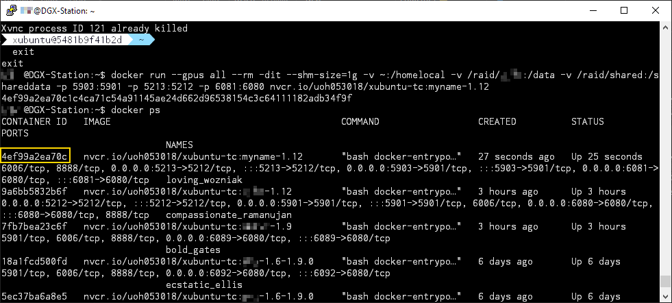
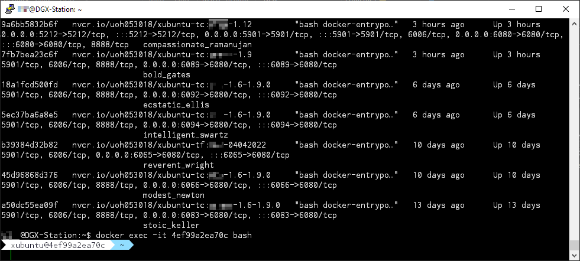
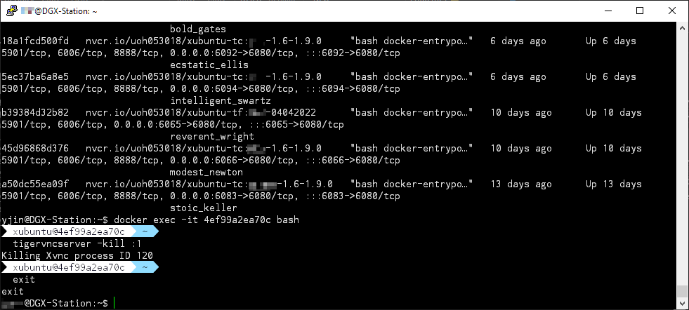

# Dockerfile Collection for DGX-230

To get back to the main page, click [here](../index).

To view the list of image building, click [here](../dockerlist).

To view the basic manual, click [here](../manual).

To view extra manuals about xUbuntu, click [here](../manual-xubuntu).

To view the **contents** of these manuals, click [here](../manual-session).

## Workflow of saving an image with the bash window lost

> * Updated on 4/20/2022
> * Should work with ver 1.4+ images

In the basic manual, we suggest that users can launch the container in the backend mode. In this case, the desktop will remain open even after we close our Putty session. However, if we are using this mode, we can not get access to the bash window where the VNC services are managed.

* **Step 1**: For example, if we run the backend mode with such a command:

    ```bash
    docker run --gpus all -dit --rm --shm-size=1g -v ~:/homelocal -v /raid/xxx:/data -v /raid/shared:/shareddata -p 5901:5901 -p 5212:5212 -p 6080:6080 <name>:<tag>
    ```

    |   Step 1 (In Putty Session 1)  |
    | :----------------------------: |
    |  |

    We will see a container ID pop up, but we are still in the Putty session on the DGX machine.

    In most cases, we assume that we do not need to save anything with a container running in the backend mode. In that case, we can go to the final step and kill the container directly if we do not need to use the container. If we want to install new packages, we **should** (1) close the current backend container, (2) and start another interactive container for installing new applications.

    But in some cases, some guys may change their minds. Although they are using the backend mode, they want to save their changes. This guide is provided for fixing this situation. Let's go to the **Step 2**.

* **Step 2**: Use the following command to view the currently running containers:

    ```bash
    docker ps
    ```

    |   Step 2 (In Putty Session 1)  |
    | :----------------------------: |
    |  |

    We can find our container ID by checking the corresponding image name and the launching time. Remember this ID.

* **Step 3**: Now run the following command

    ```bash
    docker exec -it <container-id> bash
    ```

    |   Step 3 (In Putty Session 1)  |
    | :----------------------------: |
    |  |

    This command will allow you to open a totally new bash window for a running container. Now you can confirm that you are inside the container because your user ID changes.

* **Step 4**: Like what we do in the interactive mode. Type the following command to terminate the TigerVNC service.

    ```bash
    tigervncserver -kill :1
    ```

    |   Step 4 (In Putty Session 1)  |
    | :----------------------------: |
    |  |

    After seeing the returned message, keep your Session 1 **open**, i.e. do not type `exit`.

* **Step 5**: Now, open the second session, Use the following command to save the image

    ```bash
    docker commit <container-id> <name>:<tag>
    ```

    |   Step 5 (In Putty Session 2)  |
    | :-----------------------------: |
    |  |

    The `<container-id>` can be copied from `Session 1`. It should be the same as the ID used for launching the bash in **Step 3**.

    After you see the `sha256` code, you can confirm that your image is successfully saved. Before that, **do not** close any sessions.

* **Step 6**: After we save the image, we can type `exit` in session 1.

    |   Step 6 (In Putty Session 1)  |
    | :-----------------------------: |
    |  |

    Now we can confirm that we are back to the DGX session.

* **Step 7**: Compared to what we have done in the interactive mode, there still requires another step, run the following command to kill the currently running container:

    ```bash
    docker kill <container-id>
    ```

    |   Step 7 (In Putty Session 1)  |
    | :-----------------------------: |
    |  |

    This `<container-id>` should be the same as the id in **Step 5** or **Step 3**. If you successfully kill the container, you will see the container ID in the returned message.

    > We have to kill the container manually because the original bash session is still running in the backend mode, although we are not able to get access to it. Even if you do not need to save the image, if you do not want to use the container anymore, you have to kill the container in this way. Just use `docker ps` to check the ID before killing the no longer being used container.
