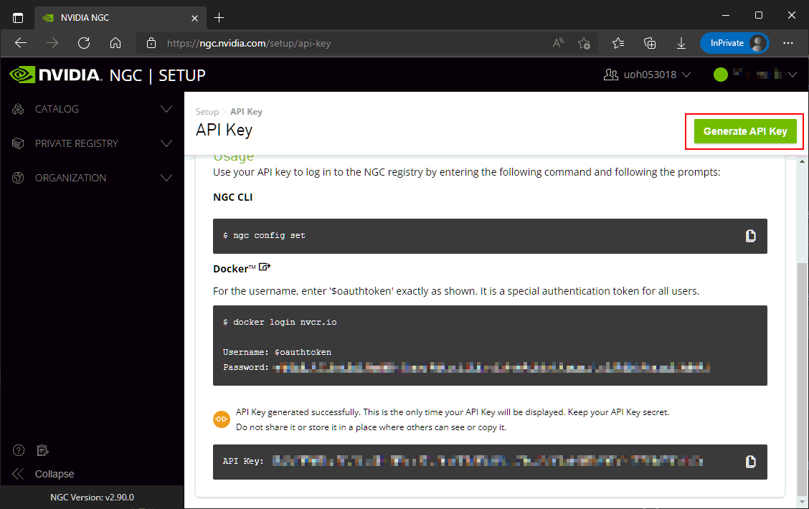

# Dockerfile Collection for DGX-230

To get back to the main page, click [here](../index).

To view the list of image building, click [here](../dockerlist).

To view the basic manual, click [here](../manual).

To view extra manuals about xUbuntu, click [here](../manual-xubuntu).

To view the **contents** of these manuals, click [here](../manual-session).

## Work with NVIDIA GPU Cloud (NGC)

> Updated on 4/20/2022

This guide will help you register your personal NGC API Key on our DGX machine. Then you can use `docker pull` to fetch the images from NVIDIA or our [private containers][docs-list] directly.

* **Step 1**: Go to the following address and log in with your personal NGC account. This account should be authorized to you by our email before.

    ```addr
    https://ngc.nvidia.com/signin
    ```

    |   Step 1 (In Browser)  |
    | :----------------------------: |
    |  |

    Click the <kbd>Continue</kbd> button for the NVIDIA account.

* **Step 2**: Login with your username and password:

    |   Step 2 (In Browser)  |
    | :----------------------------: |
    |  |

* **Step 3**: Get access to the dashboard, then open the menu in the top right corner. Select <kbd>Setup</kbd> button.

    |   Step 3 (In Browser)  |
    | :----------------------------: |
    |  |

* **Step 4**: Click the <kbd>Get API Key</kbd> button.

    |   Step 4 (In Browser)  |
    | :----------------------------: |
    |  |

* **Step 5**: Click the <kbd>Generate API Key</kbd> button, then you can see the information is updated on this page. Copy the message and keep it carefully in a file. Because you will not be able to see it if you refresh the page.

    |   Step 5 (In Browser)  |
    | :----------------------------: |
    |  |

    > Tips :bulb:: If you, unfortunately, lose your API key. You can generate a new one here. Once a new API key is generated, the previous key will get invalid automatically.

* **Step 6**: Open a new Putty session, and follow the instructions from NVIDIA (See the screenshot in **Step 5**). First, type

    ```bash
    docker login nvcr.io
    ```

    |   Step 6 (In Putty Session)  |
    | :----------------------------: |
    |  |

    It will ask you for the user name. Type `$oauthtoken` directly. Remember that the dollar symbol `$` should not be missed.

    > You can see an error message in this screenshot. That's because I update my API key for writing this guide. My cached API key on DGX gets invalid and triggers this error. It can be fixed if we log in again.

* **Step 7**: Type the password. The password should be exactly your API key. It should be a long string. You can paste it by your <kbd>Right</kbd> Click, although you can not see the text on the screen.

    |   Step 7 (In Putty Session)  |
    | :----------------------------: |
    |  |

    Now you have successfully registered.

* **Step 8**: You can try to pull an official NVIDIA docker image now. It should work properly:

    ```bash
    docker pull nvcr.io/nvidia/tensorflow:22.03-tf2-py3
    ```

    |   Step 8 (In Putty Session)  |
    | :----------------------------: |
    |  |

Remember that you can register the same API key on multiple machines. In other words, if you have a personal Linux device, you can install `docker`, log in with your account, and run a command like this:

```bash
docker pull nvcr.io/uoh053018/xubuntu-tc:1.7-1.12.0
```

to pull our pre-built image from our organization's private repository.

[docs-list]:../dockerlist
