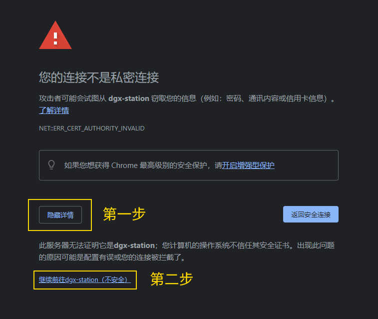
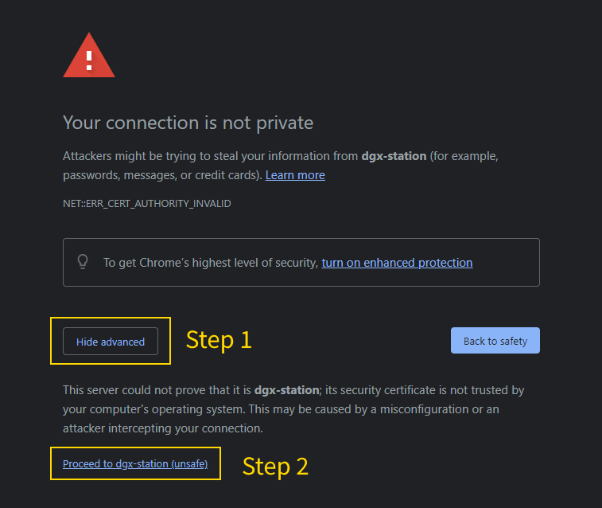

# Dockerfile Collection for DGX-230

To get back to the main page, click [here](./index).

To view the list of image building, click [here](./dockerlist).

To view the detailed graphic guides, click [here](./manual-session).

To view extra manuals about xUbuntu, click [here](./manual-xubuntu).

## Guideline for using DGX

As a DGX user, you could:

* Acquire the authority of `docker`, including:
  * Building, inspecting, committing, pulling, pushing, or deleting docker images.
  * Running, or stopping any docker container.
  * Configuring the docker parameters in your user space.
* Acquire the full authority by `sudo` **inside** any docker image.
* Upload, or download files in `~`, `/raid/<your-name>`, `/raid/shared/`
  * The above paths refer to the folders when logging in as the DGX user, not the image user.
  * Please only maintain your data in the mounted folder when inside the container. For example, if you use commands like this:
     ```bash
     docker run ... -v ~:/homelocal -v /raid/<your-name>:/data
     ```
     Then you should only save your data in `/homelocal` or `/data` inside the container.
* Use `sudo chown`, `sudo chgrp`, `sudo chown` to maintain the permission of your files.

Although you are added to the `sudo` list, you should not do the following things, because modifying the device outside the docker container may cause the device to collapse.

* You **should not** use `sudo apt` to upgrade, install or remove any package outside the docker container.
* You **should not** modify any files that are not owned by you, especially the system-related files. (However, modifying any files inside the docker container is allowed)
* You **should not** use `sudo` in any case that is not listed before.
* You **should not** use, or commit any image that is tagged as others' private images.

If you find any bugs or want to add any features, please contact the maintainer, unless you are very confident about what you will do.

## Documentation for currently built images (xUbuntu)

> Updated on 4/20/2022

Here I am maintaining a list of currently built docker images on our DGX-230. Most of them are built based on:

[xubuntu branch][git-xubuntu]

### Usage: first launch

:warning: Please pay attention to this section. To avoid authority issues, any user who intends to use the VNC desktop needs to use the following method to register the user id and VNC password for the first time.

When using this image for the first time, users need to run the following command. Only the image name and tag need to be changed according to the needs.

```bash
docker run --gpus all -it --rm xubuntu:1.0 uid=$(id -u) gid=$(id -g)
```

The image would ask users to configure the VNC password. After that, the image would suggest committing the image by a command like this:

```bash
docker commit --change='CMD [""]' <container-id> <new-image-name>:<tag>
```

The saved image should be only used by one user because the user id has been registered inside the image.

### Usage: graphic guides

For those amateurs, I have provided graphical guides for the whole workflow of working with a new image and saving it. Check the following links:

To view the detailed graphic guides, click [here :link:](./manual-session).

* [Make you able to run `docker pull` for any NVIDIA images :cloud:](./manual-session/ngc)
* [How to work with a new image, and save it :beginner:](./manual-session/interactive)
* [How to save an image with the bash window lost :beginner:](./manual-session/backend)

### Usage: interactive mode

The basic usage for any of the following images could be divided into 4 cases:

* By built-in `noVNC`: In default mode, you just need to launch the built image by:

    ```bash
    docker run --gpus all -it --rm --shm-size=1g -v ~:/homelocal -p 6080:6080 xubuntu:1.0
    ```

    The above command is the equivalent to

    ```bash
    docker run --gpus all -it --rm --shm-size=1g -v ~:/homelocal -p 6080:6080 xubuntu:1.0 --vnc
    ```

    This option would force the image to launch the VNC server.

    The following command would force the VNC to launch in the `root` mode.

    ```bash
    docker run --gpus all -it --rm --shm-size=1g -v ~:/homelocal -p 6080:6080 xubuntu:1.0 --root
    ```

    In the current version, users could use either `http` to get access to the unencrypted noVNC session or `https` to get access to the ssl-encrypted noVNC session. For users who open the encrypted session first, they may need to add the noVNC site to the trusted list. Here we show an example of how to do that in Chrome. First, we need to add `https://` at the beginning of our accessed address. Then we could check the following figures:

    | 登录有SSL保护的noVNC | Login with noVNC protected by SSL |
    | :-----: | :-----: |
    |  |  |

* By external VNC viewer: If you have installed a VNC viewer on your client side, and want to connect the VNC server of the image directly, please use:

    ```bash
    docker run --gpus all -it --rm --shm-size=1g -v ~:/homelocal -p 5901:5901 xubuntu:1.0
    ```

* By `BASH`: If you want to enter the command line but do not start the desktop, please use

    ```bash
    docker run --gpus all -it --rm --shm-size=1g -v ~:/homelocal xubuntu:1.0 --bash
    ```

* By any script: If you want to run any script inside the docker for only one time, please use

    ```bash
    docker run --gpus all -it --rm --shm-size=1g -v ~:/homelocal xubuntu:1.0 script=<the-path-to-your-script>
    ```

> Note:
>
> It is not required to launch noVNC separately for the newly released images. Because the noVNC has been built into the images. If we use `-p xxxx:6080` to launch our image, we only need to open our browser and use the following address:
>
> ```addr
> http://<dgx-230-ip>:xxxx/vnc.html?host=<dgx-230-ip>&port=xxxx
> ```
>
> If you want to connect the VNC in encrypt mode, please use:
>
> ```addr
> https://<dgx-230-ip\>:xxxx/vnc.html?host=<dgx-230-ip>&port=xxxx
> ```
>
> Here is a tip: the configs after `vnc.html` could be omitted if you only need to get access to your own desktop.

### Usage: backend mode

If you want your container to run on the backend rather than interactively, please change `-it` to `-dit`. However, this option should be only used when you are working with programs running on the backend, like the VNC server. For example:

```bash
docker run --gpus all -dit --rm --shm-size=1g -v ~:/homelocal -p 6080:6080 xubuntu:1.0
```

```bash
docker run --gpus all -dit --rm --shm-size=1g -v ~:/homelocal -p 5901:5901 xubuntu:1.0
```

In this case, unless you use `docker kill` or `docker stop` to terminate your container, the container would be kept running.

> Note:
>
> The backend mode should not be launched by the released images directly, because those images would require users to set a password when first opening the container. Users should set their passwords, save the image separately, and then could use the backend mode to launch their own images.

### Usage: save the image

When you want to save your image, follow the instructions below:

1. *(This step is confirmed to be unnecessary.)* <del>Logout from your desktop by clicking the menu on the right top corner of the desktop.</del>
2. Hit <kbd>Ctrl</kbd>+<kbd>C</kbd> on your interactive terminal. This operation would terminate noVNC. You will see the `websockify` of noVNC is interrupted.
3. Use the following command to terminate the VNC server:

    ```bash
    tigervncserver -kill :1
    ```

4. Open another terminal. In that terminal, you should be outside of the image, use the following command to save your current container as a new image:

    ```bash
    docker commit <container-id> <image-name>:<tag>
    ```

    The `<image-name>` and `<tag>` could be determined by yourself. However, `<container-id>` should be found on your container-side terminal, it should follow the user name of your bash, like this:

    ```no
    xubuntu@<container-id>: $
    ```

    or this (in root mode):

    ```no
    root@<container-id>: #
    ```

> Note 1:
> If you are saving a container launched with options (for example, `docker run ... xubuntu:1.0 --bash`), you need to use the following command to save the image with the options flushed:
>
> ```bash
> docker commit --change='CMD [""]' <container-id> <image-name>:<tag>
> ```
>
> If you do not add the option, your launching options would be remembered in your new image.

> Note 2:
>
> In **any** case when you launch your container by backend mode (with option `-dit`), you should not commit your image, because you could not kill your `tigervncserver` without the interactive shell.

### Usage: more usages

#### Since ver 1.7

:warning: The following new features are firstly implemented in ver 1.7 desktop. Check the links to learn details.

* [File transfer: How to use FileBrowser :cloud:](./manual-xubuntu/file-browser)
* [File transfer: How to use Cloudreve (experimental) :cloud: :telescope:](./manual-xubuntu/cloudreve)
* [Technique: How to use `sudo` :hammer:](./manual-xubuntu/use-sudo)
* [Technique: How to use `mamba` :hammer:](./manual-xubuntu/use-mamba)
* [Technique: How to configure `oh-my-posh` :hammer:](./manual-xubuntu/use-omp)
* [Quick script: The command `set-bing-wallpaper` :scroll:](./manual-xubuntu/set-bing-wallpaper)
* [Quick script: The command `yjin-tool` :scroll:](./manual-xubuntu/yjin-tool)
* [Quick script: The command `xvnc-launch` (experimental) :scroll: :telescope:](./manual-xubuntu/xvnc)

#### Since ver 1.6

* [Quick script: The command `user-mapping` :scroll:](./manual-xubuntu/user-mapping)

## Documentation for currently built images (Jupyter Lab)

> Updated on 1/16/2021

Here I am maintaining a list of currently built docker images on our DGX-230. Most of them are built based on:

[jupyterlab branch][git-jlab]

### Usage: interactive mode

The basic usage for any of the following images could be divided into 4 cases:

* By built-in `Jupyter Lab`: In default mode, you just need to launch the built image by:

    ```bash
    docker run --gpus all -it --rm --shm-size=1g -v ~:/homelocal jlab:1.0 -p 6080:6080 password=openjupyter rootdir=/homelocal
    ```

    The `password` would override the default random token. The `rootdir` is the root folder of the launched jupyter lab. If not set `rootdir`, the default root folder would be `/homelocal`. You could also add the `--jlab` flag. The `--jlab` flag is required when you need to force the image to switch to Jupyter Lab mode.

* By `BASH`: If you want to enter the command line but do not start the desktop, please use

    ```bash
    docker run --gpus all -it --rm --shm-size=1g -v ~:/homelocal jlab:1.0 --bash
    ```

* By any script: If you want to run any script inside the docker for only one time, please use

    ```bash
    docker run --gpus all -it --rm --shm-size=1g -v ~:/homelocal jlab:1.0 script=<the-path-to-your-script>
    ```

> Note:
>
> If you start your container with a configured password, you could open the following address directly and fill in your password:
>
> ```addr
> http://<dgx-230-ip>:xxxx
> ```
>
> When you start your container without configuring the password, you would still be asked for a token, which would be shown in your terminal. In this case, we could use this address to skip the step for filling in the token:
>
> ```addr
> http://<dgx-230-ip>:xxxx/?token=<token-from-the-terminal>
> ```

### Usage: backend mode

If you want your container to run on the backend rather than interactively, please change `-it` to `-dit`. However, this option could be directly used for the released image. You do not need to save your own image first. For example:

```bash
docker run --gpus all -dit --rm --shm-size=1g -v ~:/homelocal -p 6080:6080 jlab:1.0 password=....
```

In this case, unless you use `docker kill` or `docker stop` to terminate your container, the container would be kept running.

> Note:
>
> When starting your container without setting the password, **do not** use the backend mode, because you will be asked for a token instead of the password, but you could only find the token from the terminal in this case.

### Usage: save the image

When you want to save your image, follow the instructions below:

1. Hit <kbd>Ctrl</kbd>+<kbd>C</kbd> on your interactive terminal. This operation would terminate `Jupyter Lab`.
2. Open another terminal. In that terminal, you should be outside of the image, use the following command to save your current container as a new image:

    ```bash
    docker commit <container-id> <image-name>:<tag>
    ```

    The `<image-name>` and `<tag>` could be determined by yourself. However, `<container-id>` should be found on your container-side terminal, it should follow the user name of your bash, like:

    ```no
    root@<container-id>: # 
    ```

> Note 1:
> If you are saving a container launched with options (for example, `docker run ... jlab:1.0 --bash`), you need to use the following command to save the image with the options flushed:
>
> ```bash
> docker commit --change='CMD [""]' <container-id> <image-name>:<tag>
> ```
>
> If you do not add the option, your launching options would be remembered in your new image.

> Note 2:
>
> In **any** case when you launch your container by backend mode (with option `-dit`), you should not commit your image, because you could not kill your `jupyterlab` without the interactive shell.

[git-xubuntu]:https://github.com/Y326s/DGX-DockerImages/tree/xUbuntu_YL "xUbuntu_YL"
[git-jlab]:https://github.com/Y326s/Dockerfiles/tree/jupyterlab "Jupyter Lab"
[nv-tf]:https://ngc.nvidia.com/containers/uoh053018:xubuntu-tf "X-Ubuntu Tensorflow"
[nv-tc]:https://ngc.nvidia.com/containers/uoh053018:xubuntu-tc "X-Ubuntu PyTorch"
